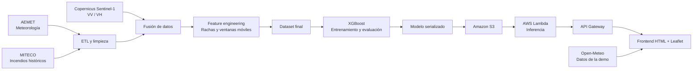

# Sistema de predicción de riesgo de incendios forestales

> Trabajo de Fin de Grado | Universidad de Alcalá
> Interfaz Visual https://eliiss.github.io/TFG/frontend_tfg/

Sistema end-to-end de análisis y predicción de incendios forestales en España que combina datos meteorológicos, registros históricos de incendios y observación terrestre mediante Sentinel-1. El resultado es una herramienta de apoyo a la decisión que muestra el riesgo estimado por provincia en un mapa interactivo.


## El proyecto en una mirada

Los incendios forestales dependen de la interacción entre condiciones meteorológicas, sequedad acumulada y estado de la vegetación. Este proyecto transforma esas señales en una probabilidad de incendio para una provincia y una fecha determinadas.

**La idea central:** integrar datos heterogéneos, construir variables temporales sin fuga de información, entrenar un modelo para un problema desbalanceado y poner la inferencia a disposición de una interfaz geográfica sencilla.

### Resultados destacados

| Aspecto | Resultado |
| --- | --- |
| Modelo | XGBoost / Gradient Boosting |
| Métrica ROC-AUC | 0.8348 |
| Recall | 76% |
| Predicción | Probabilidad entre 0 y 1 |
| Interfaz | Mapa interactivo por provincias |
| Arquitectura cloud | API Gateway + AWS Lambda + Amazon S3 + Docker |

> La probabilidad mostrada es una predicción del modelo, no una confirmación de que exista un incendio. El sistema está pensado como apoyo a la decisión y no sustituye a los servicios oficiales de emergencia.

## Arquitectura



## Flujo de datos

1. **ETL meteorológico e histórico:** se limpian y agregan los datos de AEMET por provincia y fecha, y se etiquetan los días con incendios registrados por MITECO.
2. **Observación satelital:** se consultan imágenes radar Sentinel-1 a través de Copernicus Data Space Ecosystem y se calculan las señales `VV`, `VH` y el ratio `VH/VV`.
3. **Fusión:** se unen las fuentes meteorológica y satelital por provincia y fecha, imputando los pasos sin observación mediante el último valor disponible.
4. **Ingeniería de características:** se calculan la racha seca y medias móviles de precipitación y temperatura para ventanas de 3, 7 y 14 días. Las ventanas usan únicamente información previa mediante `shift(1)`.
5. **Entrenamiento:** XGBoost aprende a distinguir días con y sin incendio. `scale_pos_weight` compensa el desbalanceo de clases sin generar observaciones sintéticas.
6. **Inferencia:** Lambda descarga el modelo desde S3, recibe las variables por HTTP y devuelve la probabilidad estimada.

## Demo web

La interfaz permite seleccionar una provincia sobre un mapa de España y consultar su nivel de riesgo. El color representa la probabilidad devuelta por la API:

- Verde: riesgo bajo, menos del 25%.
- Amarillo: precaución, entre el 25% y el 50%.
- Naranja: alerta, entre el 50% y el 75%.
- Rojo: riesgo alto, 75% o más.

La demo obtiene la meteorología reciente desde [Open-Meteo](https://open-meteo.com/). Para mantener la experiencia interactiva, la versión web utiliza valores representativos para las variables Sentinel-1; el pipeline de entrenamiento sí incorpora las observaciones satelitales descargadas desde Copernicus.

## Estructura del repositorio

```text
.
├── 01_etl_aemet_miteco.py       # Construcción del dataset meteorológico etiquetado
├── 02_copernicus_download.py    # Descarga y transformación de Sentinel-1
├── cruce.py                     # Fusión de meteorología e información satelital
├── 04_quality_check.py          # Control de calidad y filtrado final
├── 05_feature_engineering.py    # Variables temporales para el modelo
├── 06_train.py                  # Entrenamiento, evaluación y exportación
├── dataset_TFG_VIYA_READY_CLEAN.csv
├── datos_base.csv
├── modelo_gradient_boosting.pkl
├── columnas_modelo.pkl
├── frontend_tfg/                # Interfaz web con Leaflet
└── lambda_container/             # Contenedor para AWS Lambda
```

## Instalación y uso local

### 1. Preparar el entorno

```bash
python -m venv .venv
```

En Windows PowerShell:

```powershell
.\.venv\Scripts\Activate.ps1
pip install -r .requirements.txt
```

El fichero de requisitos contiene las librerías utilizadas durante el análisis, la descarga satelital, el modelado y la visualización.

### 2. Ejecutar el pipeline

Los scripts deben ejecutarse desde la raíz del repositorio y en este orden:

```powershell
python 01_etl_aemet_miteco.py
python 02_copernicus_download.py
python cruce.py
python 04_quality_check.py
python 05_feature_engineering.py
python 06_train.py
```

La descarga de Copernicus requiere credenciales en un fichero `.env` local:

```env
CDSE_CLIENT_ID=tu_client_id
CDSE_CLIENT_SECRET=tu_client_secret
```

No publiques nunca ese fichero ni credenciales en el repositorio.

### 3. Ejecutar la interfaz

La interfaz necesita servirse por HTTP para permitir las peticiones externas. En Windows:

```powershell
cd frontend_tfg
.\start_server.ps1
```

Después, abre [http://localhost:8080](http://localhost:8080). La URL de API configurada en `frontend_tfg/app.js` apunta a la API desplegada en AWS; para utilizar otra, sustituye `API_URL` por tu endpoint de API Gateway.

## Despliegue serverless

El directorio `lambda_container/` contiene el contenedor de inferencia:

- Imagen base oficial de AWS Lambda para Python 3.11.
- Dependencias instaladas como binarios para reducir problemas de compatibilidad.
- Modelo y lista de columnas descargados desde Amazon S3 durante la ejecución.
- Respuesta JSON con el campo `riesgo`.

Ejemplo de cuerpo esperado por la función:

```json
{
  "prec": 0.0,
  "tmin": 18.2,
  "tmax": 34.5,
  "velmedia": 22.0,
  "VV_dB": -12.5,
  "VH_dB": -18.0,
  "VH_VV_Ratio": -5.5,
  "dry_streak": 8,
  "prec_roll3": 0.2,
  "tmax_roll3": 31.4,
  "prec_roll7": 1.1,
  "tmax_roll7": 30.8,
  "prec_roll14": 4.6,
  "tmax_roll14": 29.9
}
```

Respuesta:

```json
{
  "riesgo": 0.853
}
```

## Tecnologías

**Datos y ciencia:** Python, pandas, NumPy, scikit-learn, XGBoost, AEMET, MITECO, Copernicus Sentinel-1.

**Cloud y MLOps:** Docker, AWS Lambda, Amazon S3, Amazon ECR, API Gateway.

**Frontend:** HTML, CSS, JavaScript, Leaflet.js, OpenStreetMap y Open-Meteo.

## Limitaciones y siguientes pasos

- Incorporar observaciones Sentinel-1 actualizadas directamente en la inferencia de la demo.
- Validar el modelo con particiones temporales y geográficas para medir mejor su capacidad de generalización.
- Añadir monitorización de predicciones, latencia y deriva de datos en AWS.
- Automatizar la actualización del dataset y del modelo mediante un pipeline CI/CD.
- Versionar datasets y modelos con trazabilidad de experimentos.

## Autor

**Elizabeth**  
Trabajo de Fin de Grado sobre predicción de riesgo de incendios forestales mediante inteligencia artificial, datos satelitales y arquitectura cloud.

Si este proyecto te resulta útil o quieres conocer más detalles técnicos, puedes abrir una issue o contactar conmigo a través de mi perfil de GitHub.
